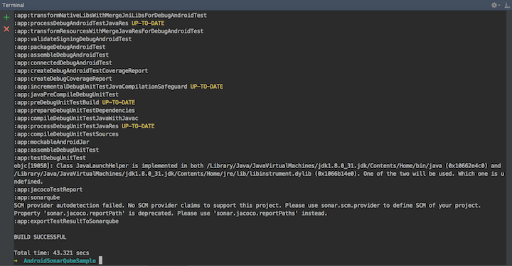

# Android SonarQube Project

### by Romell Domínguez
[](https://www.romellfudi.com/)

Comenzemos primero configurando nuestro entorno de pruebas.

Las pruebas unitarias fueron trabajadas con SONARQUBE

[](https://www.sonarqube.org/)

# Install SonarQube

Agregar el repositorio maven en el projecto con el classpath del sonarqube:
```gradle
maven {
        url "https://plugins.gradle.org/m2/"
}
classpath "org.sonarsource.scanner.gradle:sonarqube-gradle-plugin:2.3"
```

En nuestro módulo de la app, debemos usar el de *jacoco* para el reporte de pruebas como el del sonar para el envio repectivo de los resultados:

```gradle
apply plugin: "org.sonarqube"

apply plugin: 'jacoco'
jacoco {
    toolVersion = "0.7.5.201505241946"
}
```
## Configure Android Project

Creamos un task para la creación del reporte del cóidgo. **Puede ser complicado la configuración si usan flavors pero si es soportado por Gradle:**

```gradle
task jacocoTestReport(type: JacocoReport, dependsOn: ['testDebugUnitTest', 'createDebugCoverageReport'])
```

También creamos un task para la conexión con el sonar, mencionando algunas propiedades:

* **projectKey**: nombre con único dentro del sonar, usado para futuras revisiones
* **url**: ruta de la ubicación del repositorio del sonarQube

```gradle
sonarqube {
    properties {
        ...
        property "sonar.projectKey", "sonar_qube_sample"
        property "sonar.projectName", "SonarQube Sample Ver. 1"
        property "sonar.projectVersion", "1.0.f"
        property "sonar.host.url", "http://localhost:9000"
        ...
    }
}
```

Ahora configuramos las pruebas: habilitamos las pruebas de coverturas, evitamos que se detenga por verificación de código (*problemas críticos*) ya que estos lo analizaremos desde el SonarQube, y finalmente indicamos que los reportes tengan el formato jacoco.

```gradle
android {
    buildTypes {
        debug {
            testCoverageEnabled = true
        }
    }
    lintOptions {
        abortOnError false
    }
    testOptions {
        unitTests.all {
            jacoco {
                includeNoLocationClasses = true
            }
        }
    }
}
```

Por último creamos un task para realizar el envio más eficiente:

```gradle
task exportTestRultToSonarqube(dependsOn: ['jacocoTestReport','sonarqube']){
}
```

## SonarQube Server Instance

Para esta demostración se usará la versión 7.2, al inizializarlo mediante:

```sh
sh sonar.sh start
```

En nuestro navegador vemos:


Nos presentará un dashboard, que puede ser administrado para tener protegido las revisiones, pero por defecto esta permitido publicar resultados

Teniendo todos los componentes funcionando, procederemos a la ejecución de las pruebas, creación y envio del reporte mediante el task *exportTestResultToSonarqube*:

```sh
./gradlew exportTestResultToSonarqube
```

Cuando el task acabe tendremos la confirmación:



En nuestro dashboard, vemos que ya se encuentra los resultados de nuestra pruebas 


Vemos las primeras métricas: cantidad de bugs, vulneraciones de seguridad, porcentaje de pruebas de covertura, y porcentaje de duplicado


Podemos percatarnos el nombre del proyecto y el nombre clave  que se encuentra en la url:


Sonar, es una herramienta que proporciona una gran variedad de métricas


Por último detenemos el sonar en caso se requiera:

```sh
sh sonar.sh stop
```

### License
```
Copyright 2018 Romell D.Z.

Licensed under the Apache License, Version 2.0 (the "License");
you may not use this file except in compliance with the License.
You may obtain a copy of the License at

http://www.apache.org/licenses/LICENSE-2.0

Unless required by applicable law or agreed to in writing, software
distributed under the License is distributed on an "AS IS" BASIS,
WITHOUT WARRANTIES OR CONDITIONS OF ANY KIND, either express or implied.
See the License for the specific language governing permissions and
limitations under the License.
```

2018, July